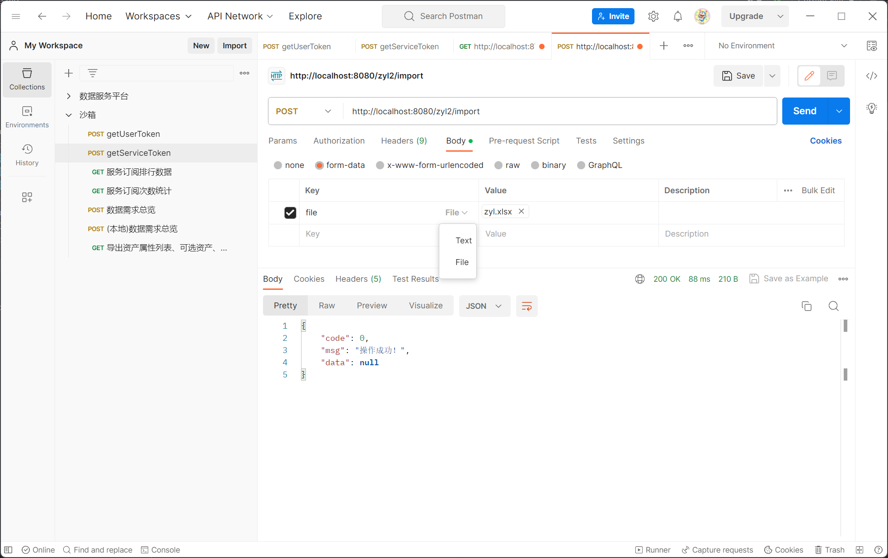

 # 项目介绍：
> **导入、导出的练习**

## 一、file
- 用于存放示例文件
- Markdown图片

## 二、测试
- 用postman上传，选择form-data



- 数据结果

```java

list: [{"姓名":"郭吉孟","是否傻逼":"是","哈哈":"1","年龄":"18","性别":"女"},{"姓名":"郭吉孟","是否傻逼":"是","哈哈":"1","年龄":"19","性别":"女"},{"姓名":"郭吉孟","是否傻逼":"是","哈哈":"1","年龄":"20","性别":"女"},{"姓名":"郭吉孟","是否傻逼":"是","哈哈":"1","年龄":"21","性别":"女"},{"姓名":"郭吉孟","是否傻逼":"是","哈哈":"1","年龄":"22","性别":"女"}]
{姓名=郭吉孟, 是否傻逼=是, 哈哈=1, 年龄=18, 性别=女}
{姓名=郭吉孟, 是否傻逼=是, 哈哈=1, 年龄=19, 性别=女}
{姓名=郭吉孟, 是否傻逼=是, 哈哈=1, 年龄=20, 性别=女}
{姓名=郭吉孟, 是否傻逼=是, 哈哈=1, 年龄=21, 性别=女}
{姓名=郭吉孟, 是否傻逼=是, 哈哈=1, 年龄=22, 性别=女}

```

